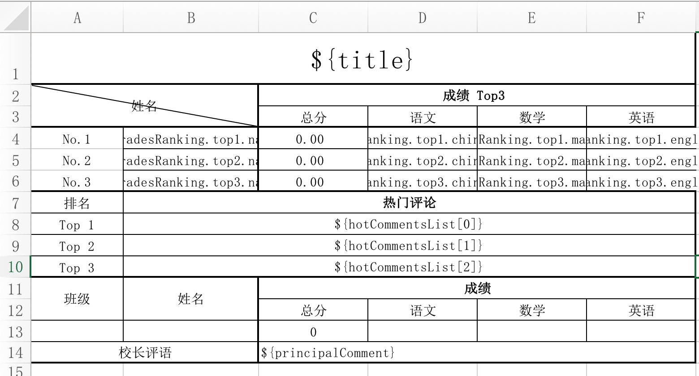
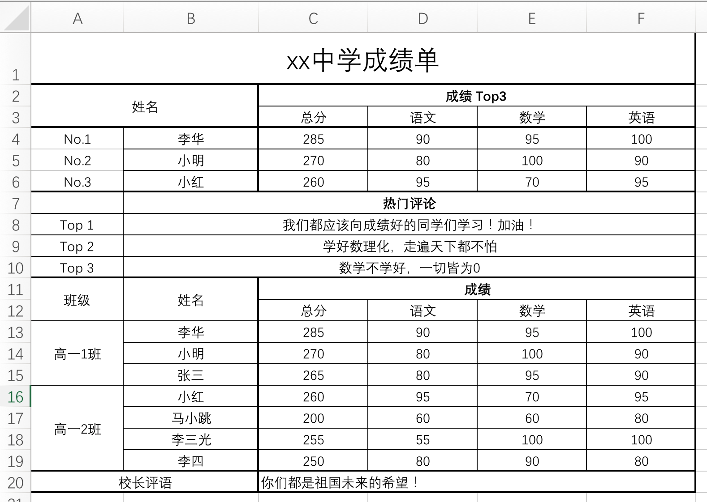

# Chimm.Excel —— 设置模板，填充数据，就完事儿了~


<div align="center">

<p>
    
    
</p>
<p>
	</img>
	</img>
	</img>
	</img>
	</img>
</p>

<div align="center">
<a href="https://gitee.com/chimmhuang/chimm.excel">码云</a> | <a href="https://github.com/chimmhuang/chimm.excel">GitHub</a>
</div>
</div>


## 1. 项目介绍
### 1.1 简介
`Chimm.Excel` 是什么？ 
该程序是一个用 Java 写的 Excel 生成工具，基于模板操作，简单，快捷，易上手。

### 1.2 特性
1. 数据组装方式大有不同
   
   和网上部分开源软件的区别是，这个程序是基于 excel 模板驱动的，需要在模版里填写变量名称，而并非在程序中添加注解。

2. 为什么不采用基于注解的方式？

   网上一些基于注解的 excel 导出，基本上只能导出简单的表格样式。该程序使用的是 excel 模板，所以可以导出一些比较复杂的表格样式。

3. Antlr4
   
   Antlr (ANother Tool for Language Recognition) 是一个强大的跨语言语法解析器，可以用来读取、处理、执行或翻译结构化文本或二进制文件。它被广泛用来构建语言，工具和框架。Antlr可以从语法上来生成一个可以构建和遍历解析树的解析器。由于该程序是基于 `Antlr4` 进行开发的，所以在变量定义上面，非常的灵活，我们可以定义集合变量，甚至我们还可以在公式中定义变量。一个表格对应一个数据对象，开发人员只需查询数据、组装数据即可。

4. excel 模板如何生成？  
模板生成非常的简单，我们定义变量的时候，只需要使用 `$` + `大小括号` 包围的形式即可，如：`${school.name}`。
   
5. `Chimm.Excel` 功能简介
	- [x] 导出excel二进制文件
      - [x] 支持多 `sheet` 页导出（v1.4.0）
	- [x] 根据模板中的变量，将值写入
	- [x] 支持公式
    	- [x] 支持带变量的公式，如：`SUM(A1,A2,${demo.value})`
	- [x] 操作表格添加/减少行
    	- [x] ⭐️添加行会自动更新公式
	- [x] 合并单元格（支持批量合并）
	- [x] 更改单元格边框样式（加粗、虚线等）
    - [x] 支持设置超链接（v1.2.0）

## 2. 功能展示

我提供了一个 `demo` 测试类。  
模板具体位置： [`src/test/resources/demo.xlsx`](./src/test/resources/demo.xlsx)   
测试类的具体位置：[`src/test/java/../demo/Demo.java`](./src/test/java/com/github/chimmhuang/excel/demo/Demo.java)

**模板文件：**


**处理后的文件：**


## 3. 项目结构
```
.com.github.chimmhuang
└── excel
    ├── ExcelHelper.java    整个程序的主入口
    ├── exception           自定义异常
    ├── parser              Antlr4解析文件
    └── tablemodel          表格相关的类
```
### 3.1 ExcelHelper - 表格处理对象
该对象是 `Chimm.Excel` 整个程序的主入口，提供了 **创建 excel 工作簿**、**获取 sheet 页表格**、**填充模板数据**、**导出二进制**等功能，下面我将详细的介绍主要的方法。

- `createWorkbook(byte[] bytes)`    
    创建 excel 工作簿：该方法是将二进制模板文件，封装为 `ExcelWorkbook` 对象，并返回。

- `getSheetTable(byte[] bytes, int sheetIndex)`
- `getSheetTable(byte[] bytes, String sheetName)`    
    获取对应 sheet 页的表格对象：该方法获取传入的二进制模板文件中指定 `sheet` 页的表格对象。

- `fillInData(SheetTable table, Object data)`    
    将变量填充入表格：该方法是将已经封装好了的表格**数据对象** 填充到 模板表格 里。

- `convert2Byte(SheetTable table)`    
    该方法会将指定的表格对象转换为 excel 二进制文件


### 3.2 ExcelWorkbook - excel对象
该对象对应的是整个 excel 文件，包含了所有 sheet 页的表格对象，目前阶段该对象的实际使用场景并不太多，所以提供的方法较少

- `getSheet(int index)`
- `getSheet(String sheetName)`    
    获取指定的 sheet 页对象，并返回。

- `getXssfWorkbook()`    
    该方法会返回 Apache poi 原生的 `xssfWorkbook` 对象，提供给开发者进行 poi 的一些原生操作。
    
    
### 3.3 SheetTable - 表格对象
该对象对应的是 sheet 页的表格。提供了一些操作表格样式的方法

- `getRow(int rowNum)`    
    获取指定行号的行对象。

- `removeRowGE(int rowNum)`    
    删除行号大于等于指定 rowNum 的行对象

- `appendRow(Row srcRow)`    
    在表格最后添加一行

- `mergeCell(int firstRowNum, int lastRowNum, String firstColName, String lastColName)`    
- `mergeCellBatch(List<MergedRegion> mergedRegionList)`
    合并单元格

- `setBorderStyle(int firstRowNum, int lastRowNum, String firstColName, String lastColName, BorderStyle borderStyle, BorderPositionEnum borderPositionEnum)`    
    设置指定范围的边框的样式，你可以更改边框的样式，如粗线、虚线等
  
- `setSheetName(String sheetName)`
    设置 sheet 页名称
    
### 3.4 Row - 行对象
该对象对应的是 excel 的行，提供了一些对行进行操作的方法

- `getCell(String cellName)`    
    获取该行指定列的单元格对象

- `copy()`    
    复制一个该对象（深克隆该对象）。

- `setBorderStyle(BorderPositionEnum positionEnum, BorderStyle borderStyle)`    
    设置该行边框的样式，你可以更改边框的样式，如粗线、虚线等
    
### 3.5 Cell - 单元格对象
该对象对应的是 excel 的单元格。提供了一些对单元格操作的方法

- `getValue()`
- `setValue(Object value)`    
    获取/设置 该单元格的值

- `setFormula(String formula)`    
    设置该单元格的公式

- `setBorderStyle(BorderPositionEnum positionEnum, BorderStyle borderStyle)`    
    设置该单元格的边框的样式，你可以更改边框的样式，如粗线、虚线等
    

## 4. 使用说明
### 4.1 配置模板  
模板配置，使用 美元符号加上大括号来定义变量即可，如： `${demo.value}`。  
我在该项目中提功能 demo 使用的模板，基本满足绝大部分场景：[`src/test/resources/demo.xlsx`](./src/test/resources/demo.xlsx)

### 4.2 导入坐标
```xml
<dependency>
    <groupId>com.github.chimmhuang</groupId>
    <artifactId>chimm.excel</artifactId>
    <version>1.4.0</version>
</dependency>
```

### 4.3 功能介绍
#### 4.3.1 导入模板，导出结果表格
- 此处展示了模板的导入
- 省略了表格数据的填充，表格数据填充需要让我们定义的表格变量类与模板上的变量名称一一对应即可，此处省略。
- 展示了填充完数据后，最终生成的字节对象，即是我们期望的结果表格，开发者可以操作该对象进行文件的导出或上传。
```java
public void testFillInTable() throws Exception {
    // 获取文件的二进制
    File file = new File("src/test/resources/demo.xlsx");
    byte[] bytes = FileUtils.readFileToByteArray(file);

    // 通过 ExcelHelper 获取 excel 表格对象
    ExcelWorkbook excelWorkbook = ExcelHelper.createWorkbook(bytes);

    // 获取指定的 sheet 页（该对象即是我们设置好的表格模板）
    SheetTable table = excelWorkbook.getSheet(0);

    // 设置 自定义 sheet 页名称
    table.setSheetName("成绩表");

    // 封装表格数据对象
    SchoolReportData tableData = new SchoolReportData();

    // ... 填充数据 ...
    tableData.setTitle("xx中学成绩单");
    // ... 省略了添加数据的代码 ...
    // ... 省略了动态设置表格样式的代码 ...
    
    // 将封装好的表格对象，填充到 excel 表格中
    ExcelHelper.fillInData(table, tableData);

    // 将表格对象转换为二进制，resultBytes 即是最终想要的结果
    byte[] resultBytes = ExcelHelper.convert2Byte(table);
}
```

#### 4.3.2 设置公式
```java
public void testFillInTable() throws Exception {
    /*
        获取文件的二进制
        通过 ExcelHelper 获取 excel 表格对象
        ...
     */

    // 获取指定的 sheet 页（该对象即是我们设置好的表格模板）
    SheetTable table = excelWorkbook.getSheet(0);
    
    // 给表格的 第13行 第A列 设置公式
    Row row13 = table.getRow(13).getCell("A").setFormula("SUM(A1,A2,${demo.value})");
}
```

#### 4.3.3 添加行/减少行
```java
public void testFillInTable() throws Exception {
    /*
        获取文件的二进制
        通过 ExcelHelper 获取 excel 表格对象
        ...
     */

    // 获取指定的 sheet 页（该对象即是我们设置好的表格模板）
    SheetTable table = excelWorkbook.getSheet(0);
    
    // 获取第13行
    Row row13 = table.getRow(13);
    
    // 将 rowNum 大于 13 的都删除，进行动态表格添加
    table.removeRowGE(13);
    
    // 复制行
    Row copy1 = row13.copy();
    Row copy2 = row13.copy();
    
    // 设置新的值
    copy1.getCell("A").setValue("copy1");
    copy2.getCell("A").setValue("copy2");
    
    // 设置完毕后，添加进表格
    table.appendRow(copy1);
    table.appendRow(copy2);
}
```

#### 4.3.4 合并单元格
```java
public void testFillInTable() throws Exception {
    /*
        获取文件的二进制
        通过 ExcelHelper 获取 excel 表格对象
        ...
     */

    // 获取指定的 sheet 页（该对象即是我们设置好的表格模板）
    SheetTable table = excelWorkbook.getSheet(0);
    
    // 合并单元格，【此处仅展示功能，需要合并的 rowNum 建议动态计算】
    table.mergeCell(13, 15, "A", "A");
    table.mergeCell(16, 19, "A", "A");
}
```

#### 4.3.5 单元格边框加粗
```java
public void testFillInTable() throws Exception {
    /*
        获取文件的二进制
        通过 ExcelHelper 获取 excel 表格对象
        ...
     */

    // 获取指定的 sheet 页（该对象即是我们设置好的表格模板）
    SheetTable table = excelWorkbook.getSheet(0);
    
    // 设置指定行的单元格样式，【此处仅展示功能：加粗，rowNum 建议动态计算】
    table.getRow(19).setBorderStyle(BorderPositionEnum.BOTTOM, BorderStyle.MEDIUM);
}
```

#### 4.3.6 设置超链接
```java
public void testFillInTable() throws Exception {
    /*
        获取文件的二进制
        通过 ExcelHelper 获取 excel 表格对象
        ...
     */

    // 获取指定的 sheet 页（该对象即是我们设置好的表格模板）
    SheetTable table = excelWorkbook.getSheet(0);

    // 设置超链接
    table.getRow(2).getCell("A").setHyperlinkURL("https://www.baidu.com");
}
```


## 5. 参与贡献
非常欢迎你的加入！[提一个 Issue](https://github.com/chimmhuang/chimm.excel/issues/new) 或者提交一个 Pull Request。

##  6. 联系作者
`QQ & 微信`：`905369866`  
`email`：`chimmhuang@163.com`

## 7. 开源协议
[Apache 2.0](LICENSE) © Chimm Huang